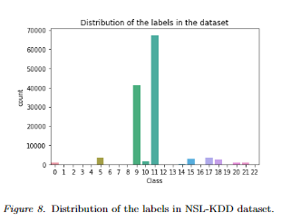
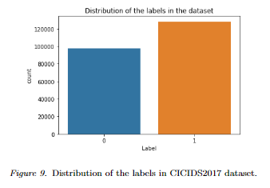
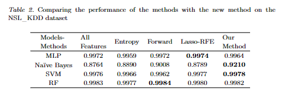

# Feature Selection Method for Network Intrusion Detection
Machine learning now has a major contribution in cyber security attacks detection especially DDoS attacks. In order to build a strong machine learning model for security systems, there is a need to focus on the most important part in model development, the data pre-processing stage. 
We focuses on feature selection which is the most critical stage in data pre-processing. we implemented four different feature selection techniques: filtering, wrapper, entropy and granular computing and embedded techniques.

For our study, we selected two datasets corresponding to the particular application domain of intrusion detection.
In the first part of our project, we split our experiments into a multiclass classification problem and a binary classification problem using the NSL_KDD and the CICIDS2017 datasets, respectively.

## Datasets: 
Canadian Institute for Cybersecurity: [link](https://www.unb.ca/cic/datasets/nsl.html)  
CICIDS2017 Dataset: [link](https://www.kaggle.com/cicdataset/cicids2017)

### The distrution of labels in the NSL_KDD and CICIDS datasets

## Tested Models
The models that were tested in this study are the following:
- The MLP classifier:  
  -  max_iter = 1000
  -  hidden_layer_sizes = (100, 200)
  -  alpha = 0.0001
  -  solver = 'adam'
- The Multinomial NB Classifier: 
  -  alpha = 1.0
  -  fit_prior = True 
- The SVM classifier:
  - C = 100
  - gamma = 1
- The Random Forest Classifier:
  - n_estimators=128
  - max_depth=None

## Tested Feature Selection Methods
The feature selection methods that were tested in this study are the following:
- Lasso-RFE
- Forward Feature Selection
- Entropy Feature Selection
- Genetic Algorithm (Multiclass classification only)

## Results
The following table summarizes the findings in the study, where we compare between the f1-scores obtained from using the different feature selection methods VS the proposed method.

